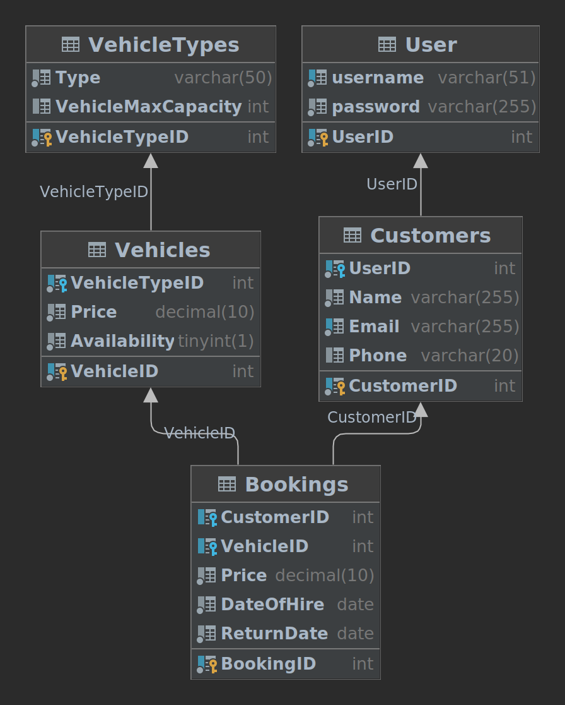

# Car Hire Management System

The Car Hire Management System is a database-driven application for managing vehicle rentals, bookings, invoices, and
daily reports. This system allows customers to book vehicles, employees to check vehicle availability, and generates
reports for daily bookings.

## Features

- **Customer Management**: Add, update, and delete customer information.
- **Vehicle Management**: Store details about vehicles, including type, make, model, year, and daily rental rates.
- **Booking Management**: Create and manage vehicle bookings with customer details, date of hire, and return date.
- **Invoice Generation**: Generate invoices for bookings, including the total amount due.
- **Daily Reports**: Automatically create daily reports showing bookings made on a specific day.
- **Vehicle Availability**: Track the availability of vehicles for booking.

## Installation

1. Clone the repository from GitHub: `git clone https://github.com/aahmedsamy/car-hire-management.git`
2. Create a MySQL database and update the database connection settings in the application.
3. Install required Python packages: `pip install -r requirements.txt`

## Database Setup

- The SQL schema for the database is provided in the `database.sql` file. Import this file to set up the database
  structure.

## Database ERD

## Usage
1. run mysql docker image by running `cd db && docker compose up --build -d`
1. Start the Flask application: `cd ../ && python run.py`
2. Access the endpoints to add, update, delete customers, get customer details, and manage bookings.
3. Reports are automatically generated at the start of each day.

## API Endpoints

- `/add_customer`: Add a new customer.
- `/update_customer/<int:customer_id>`: Update an existing customer.
- `/delete_customer/<int:customer_id>`: Delete a customer.
- `/get_customer/<int:customer_id>`: Get customer details.

## Background Jobs

- The system includes a background job to reset vehicle availability at the end of the hire period.

## Contributing

Feel free to contribute to this project by opening issues and submitting pull requests.

## Contact

For questions or inquiries, contact [Ahmed Samy](mailto:aahmedsamy.as@gmail.com).
